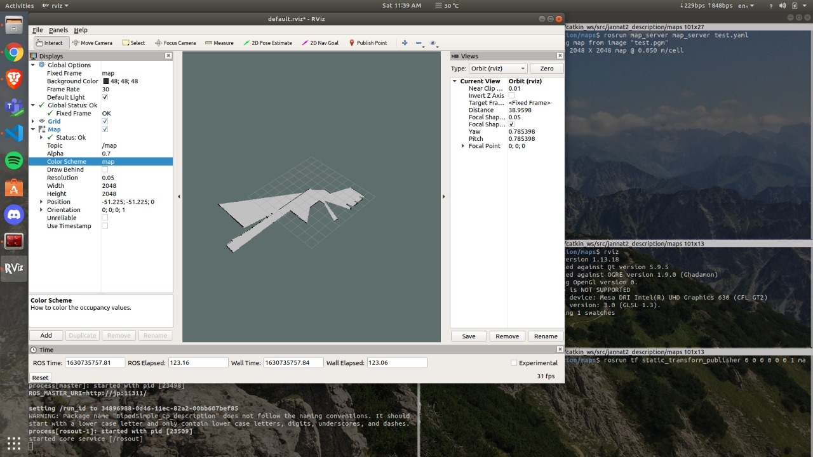
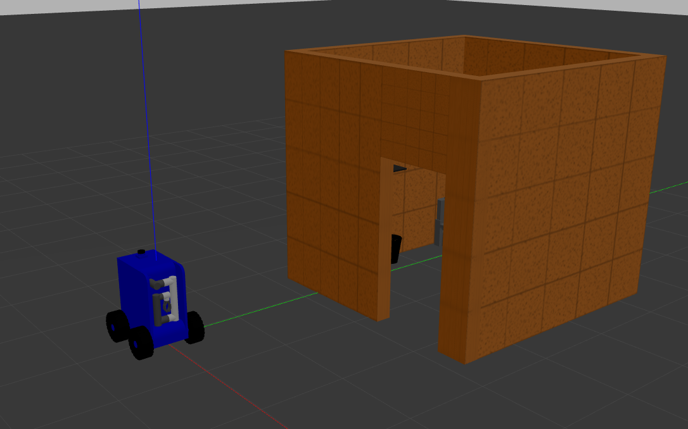
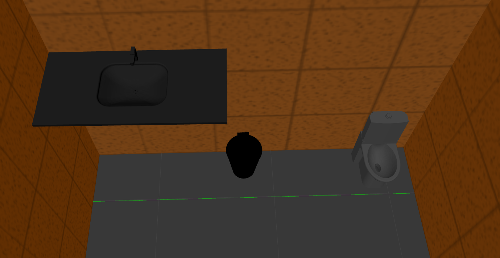
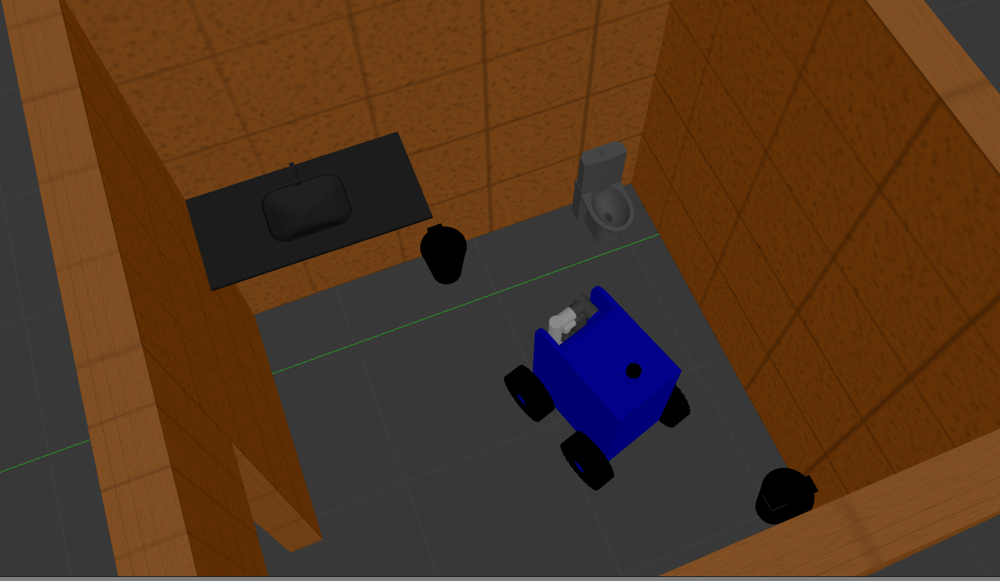

# Janatics BVM

The following command sequence and instructions associated with it will help in simulating *Janatics* performing various tasks.

## Initiating repository

```
git clone https://github.com/keivalya/janatics-bvm.git
cd janatics-bvm
```
## Initiating Docker

```
/script/build
/script/run
```

## ALTERNATIVELY: if the Dockerfile somehow fails

The only pre-requisites for this project are:

- Ubuntu 18.04
- ROS Melodic
- Gazebo 9

If these requirements meet, *Janatics* is good to go!
For doing so, just copy the `jannat2_description` folder from `catkin_ws/src` directory to your local workspace.
Run:

```
cd ~/catkin_ws/
catkin_make
```
Then run the following commands:
```
roscore
```
Open a new terminal
```
roslaunch jannat2_description jannat2_house.launch
```

## Glimpses of the project accomplished
We faced certain difficulty in dockerizing our project. However, we would like to thank team ARTPARK for this opportunity, without which we would now have been able to learn ROS1 or Docker.

### Janatics BVM Robot


### Mapping environment for the robot, in RViz:


### JanaticsBVM with environment


### Environment interior


### JanaticsBVM in environment
